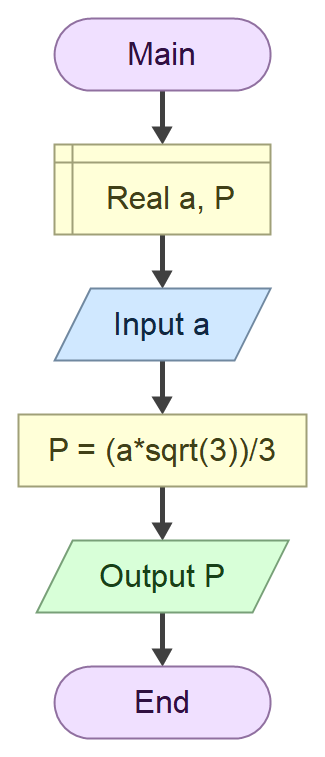

# Домаћи задатак из Техничке документације
## Задатак 
Напиши програм који на основу унете висине једнакостраничног троугла а израчунава површину П

$P = \frac{a^2 \cdot \sqrt{3}}{3}$

### Алгоритамска шема



## Решење 

``` 
using System;

namespace PovrsinaTrougla
{
    internal class Program
    {
        static void Main(string[] args)
        {
            Console.WriteLine("Unesi visinu jednakostranicnog trougla a:");
            double.TryParse(Console.ReadLine(), out double a);
            double P = (a * a * Math.Sqrt(3)) / 3;
            Console.WriteLine("Povrsina trougla je " + P);
        }
    }
}
```
### Тест примери 

Тест пример 1:

``` text
Unesi visinu jednakostranicnog trougla a:
2
Povrsina trougla je 2.309401076758503

C:\Users\Che\Desktop\Repos\ConsoleApp12\bin\Debug\PovrsinaTrougla.exe (process 14220) exited with code 0 (0x0).
Press any key to close this window . . .
```

 Tест пример 2: 

 ```
Unesi visinu jednakostranicnog trougla a:
3
Povrsina trougla je 5.196152422706632

C:\Users\velim\Desktop\Repos\ConsoleApp12\bin\Debug\PovrsinaTrougla.exe (process 15110) exited with code 0 (0x0).
Press any key to close this window . . .

```

### Објекти

| Редни број | Променљива | Тип | 
| ---------- | ---------- | --- | 
| 1.         | `a`        | `double` | 
| 2.         | `P`        | `double` |

